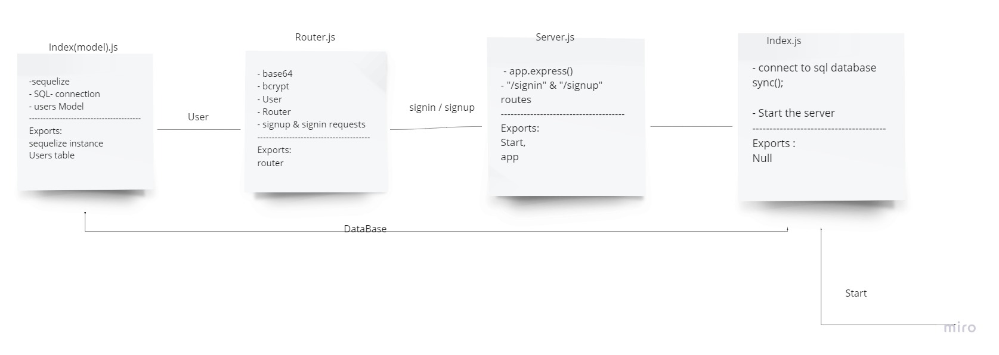

# basic-auth

## Heroku app link
[heroku-app-link](https://basic-auth-jalal.herokuapp.com/)

## Pull request
[pull-request](https://github.com/JalalHasan-22/basic-auth/pull/1)

## Actions
[Actions](https://github.com/JalalHasan-22/basic-auth/actions)

basic-auth functionality

### description

in this lab, I have created a basic express server, exported the start function and app instance. in the root index I'v started the start function with the port from .env file

I've created a user model, where I've created the schema of the table, and exported it to the index model.
I also created a route file, where I handle the login and signup pages.
I've implemented the signin process through a middleware called basic auth.

#### UML diagram

